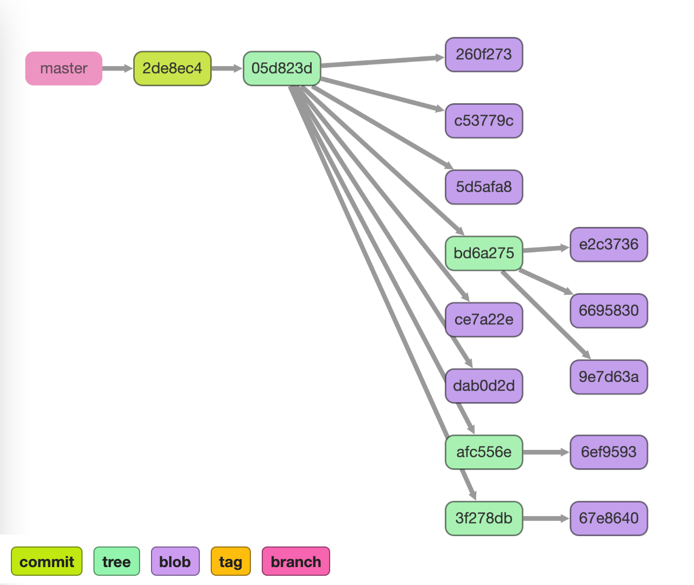
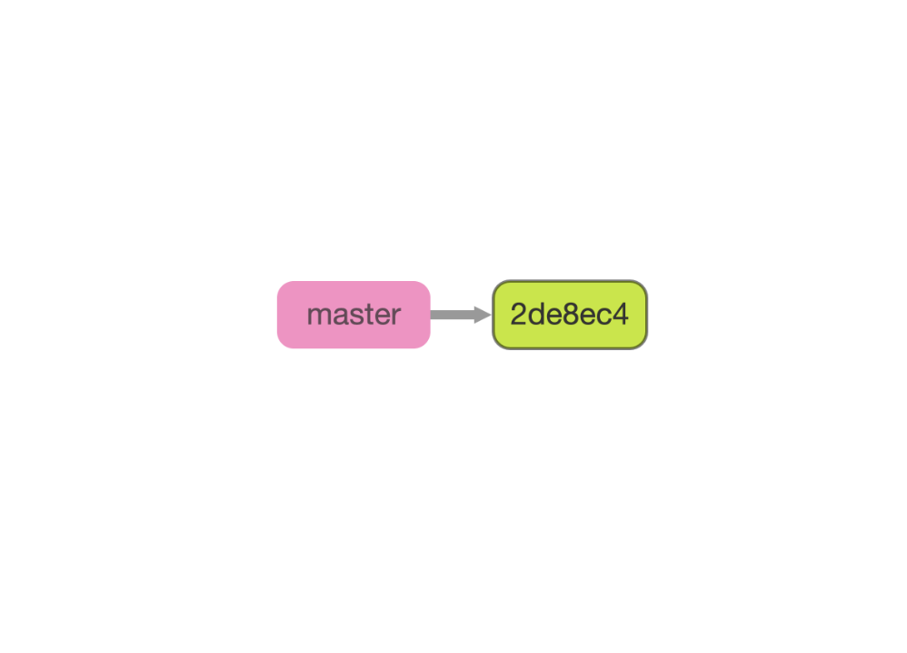

# git-dag

Show all Git objects in a repository as a DAG.

## How to use

```bash
# open git dag on your chosen repository
git-dag /path/to/the/git/repository

# or use current working directory as the repository
git-dag
```

## Screenshots

#### Show all objects




#### Show commit objects only


